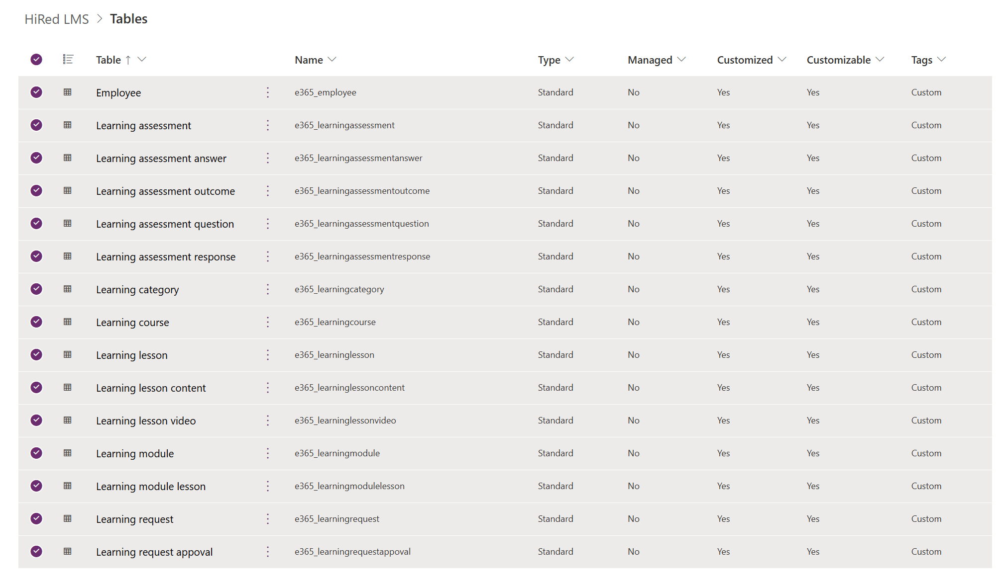

# 365 Evergreen LMS

Built using Power Apps code app (React) and Dataverse

## Summary

A responsive learning management app, designed using Fluent UI components, themes and tokens. The app will have a collapsible sidebar, dark and light modes. It must comply with common accessibility standards. Users of the app can browse content, register for courses (with forms), complete modules and assessments. Users will have a profile and can show their achievements. Users can edit their profile information: upload a photo, add a bio, list interests. Each course should have a social feed for participants to share their experiences.

## MVP user stories (draft)

Target decisions for MVP:

- Accessibility target: WCAG 2.1 AA
- Authentication: Tenant SSO (Entra ID)
- Fluent UI design system

### Theming

- As a learner, I want a responsive UI with a collapsible sidebar and theme toggle so that I can use the app on any device and switch between light/dark modes.
  - Acceptance Criteria: sidebar collapses/expands and persists per session; theme toggle persists preference; responsive layouts; WCAG 2.1 AA contrast and keyboard navigation.

### Authentication & profile

- As a user, I want to sign in using Tenant SSO so that I can access the app with my corporate account.
  
  - Acceptance Criteria: Entra ID sign-in flows, protected routes redirect to sign-in.
- As a user, I want to view and edit my profile (photo, display name, bio, interests) so I can personalize my account.
  
  - Acceptance Criteria: profile page shows fields, photo upload (<=2MB), validation, persistence to Dataverse.

### Course catalogue & registration

- As a learner, I want to browse available courses with filters and search so I can find relevant learning.
  
  - Acceptance Criteria: course list shows key metadata, search and filters return results promptly.
- As a learner, I want to register for a course using a simple registration form so I can enroll.
  
  - Acceptance Criteria: registration validates inputs, confirms enrollment, creates Dataverse enrollment record.

### Learning progress & modules

- As a learner, I want to open a course and mark modules as complete so my progress is tracked.
  - Acceptance Criteria: module complete toggles update UI and Dataverse; progress percentage displayed.

### Assessments (MVP: basic)

- As a learner, I want to complete simple assessments (quiz with auto-graded MCQs) so I can validate my learning.
  - Acceptance Criteria: MCQ auto-grading, score & pass/fail, results persist.

### Achievements & profile display

- As a learner, I want to see achievements on my profile when I complete tracked milestones so I can showcase progress.
  - Acceptance Criteria: achievements awarded and displayed with metadata.

### Course social feed (MVP: basic)

- As a course participant, I want a per-course feed where I can post text updates so I can share experiences with peers.
  - Acceptance Criteria: posts persist with author/timestamp; feed sorted by newest; basic flagging supported.

## Dataverse tables (MVP)

- 

## 